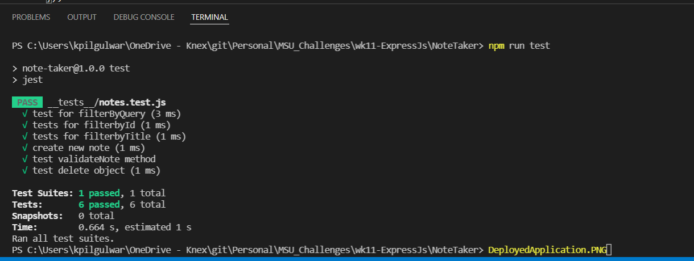
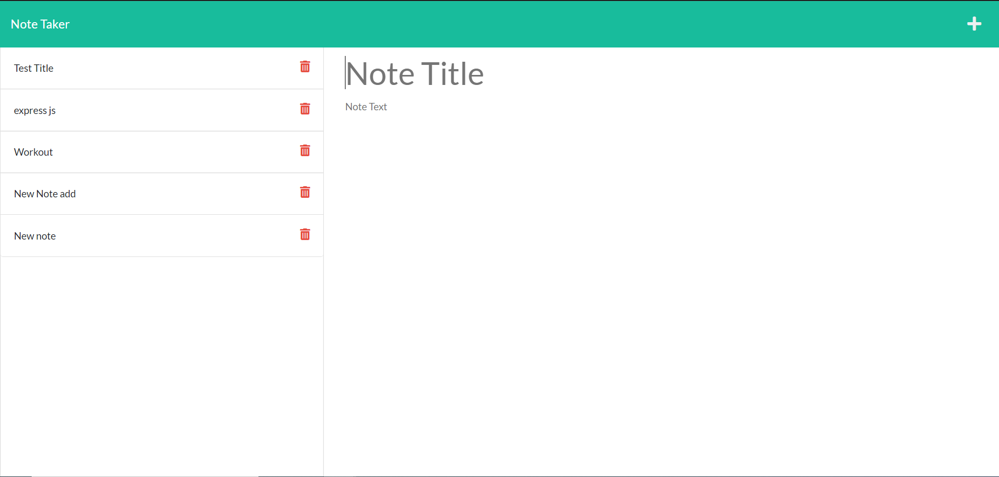

# Note Taker 

  Generates team profile data based on user input

      

  # Table of contents
  * [Purpose](#purpose)
  * [Usage](#usage)
  * [Technologies Used](#technologies-used)
  * [Test Instructions](#test-instructions)
  * [More Information](#more-information)
  * [Contributors](#contributors)
  * [License](#license)

  ## Purpose
  Application that can be used to write and save notes.

  ## Usage
  Please refer below link to use this application:
  https://note-taker-kp-challenge.herokuapp.com/

  ## Technologies Used
  - HTML
  - CSS
  - Java Script
  - NodeJs
  - Express JS
  
  ## Test Instructions
 npm run test
 

  ## More Information
  Please find below acceptance criteria of project:

    GIVEN a note-taking application
    WHEN I open the Note Taker
    THEN I am presented with a landing page with a link to a notes page
    WHEN I click on the link to the notes page
    THEN I am presented with a page with existing notes listed in the left-hand column, plus empty fields to enter a new note title and the note’s text in the right-hand column
    WHEN I enter a new note title and the note’s text
    THEN a Save icon appears in the navigation at the top of the page
    WHEN I click on the Save icon
    THEN the new note I have entered is saved and appears in the left-hand column with the other existing notes
    WHEN I click on an existing note in the list in the left-hand column
    THEN that note appears in the right-hand column
    WHEN I click on the Write icon in the navigation at the top of the page
    THEN I am presented with empty fields to enter a new note title and the note’s text in the right-hand column

  ## Deployed application:
  

  ## Contributors
  Krupali
  
  ## License
  Please consult the attached LICENSE file for details. All rights not explicitly granted by the MIT,Apache License are reserved by Original Author.    

  Copyright (c) 2021